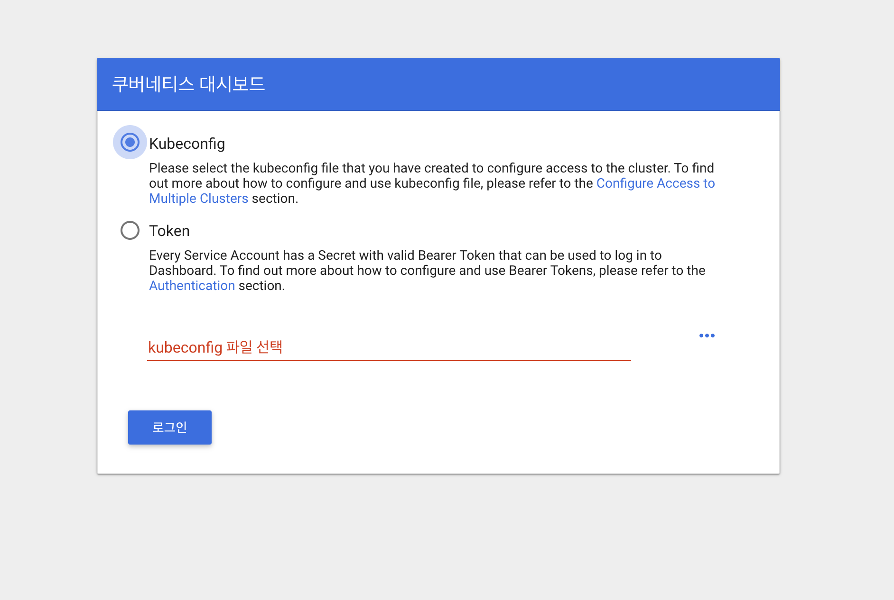

## 설치
```
$ kubectl apply -f https://raw.githubusercontent.com/kubernetes/dashboard/v1.10.1/src/deploy/recommended/kubernetes-dashboard.yaml

secret/kubernetes-dashboard-certs created
serviceaccount/kubernetes-dashboard created
role.rbac.authorization.k8s.io/kubernetes-dashboard-minimal created
rolebinding.rbac.authorization.k8s.io/kubernetes-dashboard-minimal created
deployment.apps/kubernetes-dashboard created
service/kubernetes-dashboard created
```

로컬 작업환경에서 dashboard에 접근하기 위해서 쿠버네티스 클러스터에 secure 채널을 생성해야 함.

```
$ kubectl proxy
Starting to serve on 127.0.0.1:8001
```



* **Kubeconfig** :
* **Token** : 

현재 여기 화면에서 막혀있음
