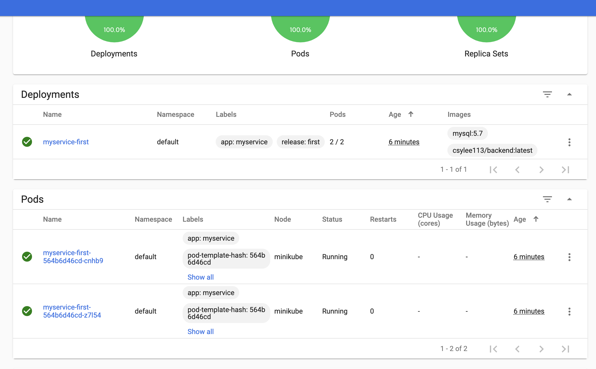
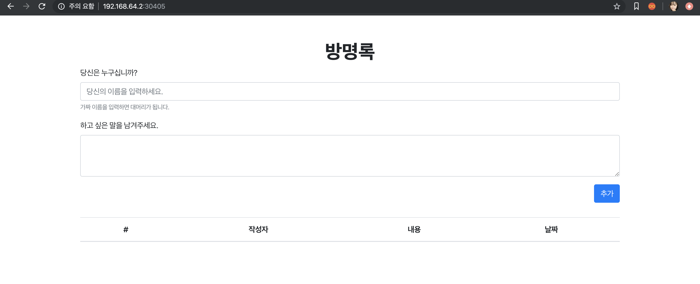
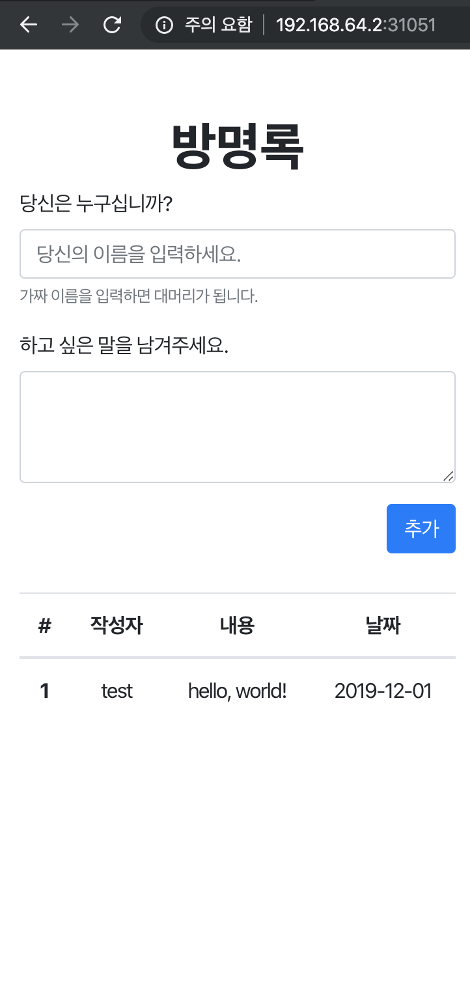
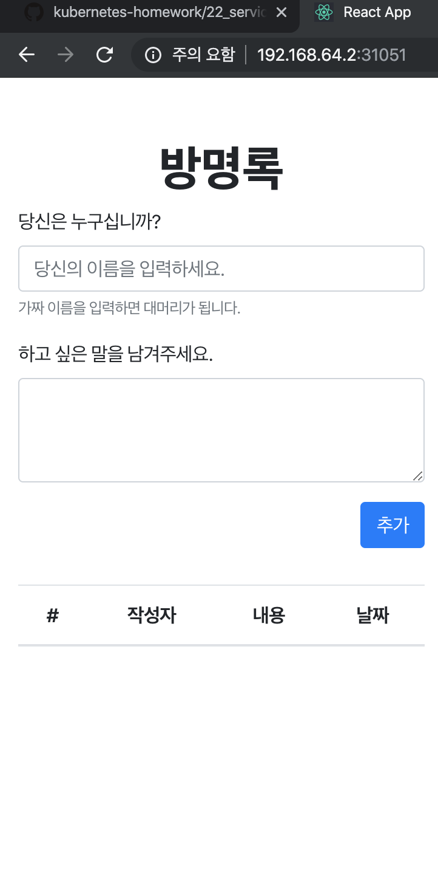

# Term Project 4
## apiVersion
* **service.yaml** : `apiVersion: v1`
* **deployment.yaml** : `apiVersion: apps/v1`

|apps/v1|v1|
|--|--|
|statefulSet|Service|

* **참고한 글** : https://matthewpalmer.net/kubernetes-app-developer/articles/kubernetes-apiversion-definition-guide.html

## kind: Deployment
stateless 앱을 배포할 때 사용하는 가장 기본적인 컨트롤러, 지금은 거의 기본적인 배포 방법으로 사용되고 있음

### 지원하는 배포 관련 기능
* 실행시켜야 하는 Pod의 갯수를 유지
* rolling update
* 배포 도중 정지 후 재배포
* 이전 버전으로 롤백

## kind: Service
일련의 Pod 엔드포인트를 단일 리소스로 그룹화
* Pod이 서비스 구성원이 되기 위해서는 셀렉터에 지정된 모든 라벨이 Pod에 포함되어야 함

### Service의 장점
* 구성원 Pod이 죽었다가 재생성되면서 IP 주소가 변경되더라도, 서비스 수명 동안 지속되는 안정적인 IP 주소를 획득
    * 외부에서는 Pod의 주소를 몰라도 되기 때문에, IP 바뀌어도 수정이 필요없음
* 부하 분산을 제공

* **참고한 글** : https://cloud.google.com/kubernetes-engine/docs/concepts/service?hl=ko

## kind: StatefulSet
> 쿠버네티스 1.9 버전 부터 정식 적용

수업 때 배우고 실습했던 ReplicaSet과 그보다 좀 더 발전된(?) Deployment는 stateless한 앱을 배포하는 데에 적절한 컨트롤러다. **stateless 하다는 것은 Pod이 수시로 리스타트 되고, 디스크 내용이 사라지더라도 실행에 문제가 없는 경우**를 말한다. 웹서버나 웹 애플리케이션 서버가 해당된다. 이와 대비되는 컨트롤러인 statefulSet은 다음과 같은 특성을 가지는 애플리케이션에 유용하다.

* 안정된, 고유한 네트워크 식별자
* 안정된, 지속성을 갖는 스토리지
* 순차적인, 정상 배포(graceful deployment)와 스케일링
* 순차적인, 자동 롤링 업데이트

이 중에서 내가 하고 있는 프로젝트는 안정된, 지속성을 갖는 스토리지에 해당한다.

### StatefulSet의 특징
* pod 이름에 대한 규칙성 부여
* 배포시 순차적인 Pod 기동과 업데이트
* 개별 Pod에 대한 디스크 볼륨 관리

* **참고한 글** : [StatefulSet을 이용하여 상태가 유지되는 Pod 관리하기](https://bcho.tistory.com/1306)

***

# 실행 과정 기록
> 주의: 프로젝트를 수행하면서 의식의 흐름대로 씀

## 환경변수 관련 문제
`my-deployment.yaml`을 실행하니 **CrashLookBackOff** 문제가 발생함

```
$ kubectl apply -f my-deployment.yaml
$ kubectl get pods
NAME                               READY   STATUS             RESTARTS   AGE
myservice-first-5ddbb855b9-nq7bg   1/2     CrashLoopBackOff   5          7m5s
myservice-first-5ddbb855b9-ql4tl   1/2     CrashLoopBackOff   5          7m5s
```

> 쿠버네티스에서 디버깅 할 때에 `kubectl describe`와 `kubectl log` 커맨드를 사용함. 잘 기억해야지.
* **참고한 글** : https://knight76.tistory.com/entry/kubernetes-CrashLoopBackOff-%EB%AC%B8%EC%A0%9C-%ED%95%B4%EA%B2%B0%ED%95%98%EA%B8%B0

```
Containers:
  db:
    Container ID:   docker://9d6118356df9727b894bdafdd6e2f4bbdd3ebfa81aac88328b82cbc13d359c29
    Image:          mysql:5.7
    Image ID:       docker-pullable://mysql@sha256:5779c71a4730da36f013a23a437b5831198e68e634575f487d37a0639470e3a8
    Port:           3306/TCP
    Host Port:      0/TCP
    State:          Waiting
      Reason:       CrashLoopBackOff
    Last State:     Terminated
      Reason:       Error
      Exit Code:    1
      Started:      Sun, 01 Dec 2019 12:04:48 +0900
      Finished:     Sun, 01 Dec 2019 12:04:48 +0900
    Ready:          False
    Restart Count:  5
    Environment:    <none>
    Mounts:
      /var/run/secrets/kubernetes.io/serviceaccount from default-token-8dpwm (ro)
  web:
    Container ID:   docker://f25b3787b8908446728e0085a69668b41e839d924eeede125c2f09b352650d9f
    Image:          csylee113/backend:latest
    Image ID:       docker-pullable://csylee113/backend@sha256:a7f63fc7d7e0a94a765ba429d125aea2bbdff3bc55b5987a0c025183f02a442e
    Port:           3000/TCP
    Host Port:      0/TCP
    State:          Running
      Started:      Sun, 01 Dec 2019 12:01:45 +0900
    Ready:          True
    Restart Count:  0
    Environment:    <none>
    Mounts:
      /var/run/secrets/kubernetes.io/serviceaccount from default-token-8dpwm (ro)
```

web 컨테이너는 잘 실행되고 있는데, db 컨테이너에서 Exit code 1과 함께 종료된 것을 확인할 수 있었음. 빼먹은 환경변수가 문제인가 싶어서 설정해주기로 함

* **참고한 글** : https://kubernetes.io/ko/docs/tasks/inject-data-application/define-environment-variable-container/

설정해주기 전에 Pod을 다 정리하고, 환경변수 설정을 추가한 Deployment를 실행했더니 정상적으로 Pod이 생성되었다.



## Port 설정 문제

```
$ kubectl cluster-info
Kubernetes master is running at https://192.168.64.2:8443
KubeDNS is running at https://192.168.64.2:8443/api/v1/namespaces/kube-system/services/kube-dns:dns/proxy

To further debug and diagnose cluster problems, use 'kubectl cluster-info dump'.

$ kubectl get all
NAME                                   READY   STATUS    RESTARTS   AGE
pod/myservice-first-564b6d46cd-cnhb9   2/2     Running   0          11m
pod/myservice-first-564b6d46cd-z7l54   2/2     Running   0          11m

NAME                 TYPE        CLUSTER-IP     EXTERNAL-IP   PORT(S)        AGE
service/kubernetes   ClusterIP   10.96.0.1      <none>        443/TCP        11m
service/myservice    NodePort    10.102.70.80   <none>        80:30704/TCP   3m18s

NAME                              READY   UP-TO-DATE   AVAILABLE   AGE
deployment.apps/myservice-first   2/2     2            2           11m

NAME                                         DESIRED   CURRENT   READY   AGE
replicaset.apps/myservice-first-564b6d46cd   2         2         2       11m
```

cluster IP 주소와 NodePort로 요청했더니 접속이 안됨

 > 약간 삘이 왓는데, 나는 Node 서버를 3000번에 열어놓고 service에서 80포트로 연결해놓은게 문제가 아닐까..? *(아직 설정파일에 port 필드를 제대로 이해를 못했다.)*

다시 서비스를 내리고 설정을 수정한 후에 실행해보았다.

```
$ kubectl delete -f my-service.yaml

## my-service.yaml 파일 수정 후
$ kubectl apply -f my-service.yaml
```

이후에 NodePort 주소를 다시 찾아서(kubectl get all) cluster IP랑 조합해서 브라우저에서 접속하니까 Node.js 서버에서 제공하는 html 파일이 뜬다.



## 컨테이너 실행 순서 문제

서비스 실행까지 성공했지만 DB와 백엔드 연결이 터진건지, 방명록 등록에 실패했다. 백엔드 서버인 web 컨테이너에 접근해서 로그를 살펴보았다.

```
$ kubectl logs -f myservice-first-564b6d46cd-cnhb9 web
Sun, 01 Dec 2019 03:15:52 GMT koa deprecated Support for generators will be removed in v3. See the documentation for examples of how to convert old middleware https://github.com/koajs/koa/blob/master/docs/migration.md at app.js:30:4
Server is running on port 3000!
Unhandled rejection SequelizeConnectionRefusedError: connect ECONNREFUSED 127.0.0.1:3306
    at /usr/src/app/node_modules/sequelize/lib/dialects/mysql/connection-manager.js:123:19
    at tryCatcher (/usr/src/app/node_modules/bluebird/js/release/util.js:16:23)
    at Promise._settlePromiseFromHandler (/usr/src/app/node_modules/bluebird/js/release/promise.js:547:31)
    at Promise._settlePromise (/usr/src/app/node_modules/bluebird/js/release/promise.js:604:18)
    at Promise._settlePromise0 (/usr/src/app/node_modules/bluebird/js/release/promise.js:649:10)
    at Promise._settlePromises (/usr/src/app/node_modules/bluebird/js/release/promise.js:725:18)
    at _drainQueueStep (/usr/src/app/node_modules/bluebird/js/release/async.js:93:12)
    at _drainQueue (/usr/src/app/node_modules/bluebird/js/release/async.js:86:9)
    at Async._drainQueues (/usr/src/app/node_modules/bluebird/js/release/async.js:102:5)
    at Immediate.Async.drainQueues [as _onImmediate] (/usr/src/app/node_modules/bluebird/js/release/async.js:15:14)
    at processImmediate (internal/timers.js:439:21)
```

DB 연결 실패 시 발생하는 에러다. kubernetes 공식 문서를 살펴보면 [Pod 내의 컨테이너는 서로 localhost로 통신할 수 있기](https://kubernetes.io/ko/docs/concepts/workloads/pods/pod-overview/#%EB%84%A4%ED%8A%B8%EC%9B%8C%ED%82%B9) 때문에, localhost로 접근해서의 문제는 아닌 것 같고, **데이터베이스 컨테이너가 실행되기 전에 백엔드 컨테이너가 실행**되어서 문제가 발생한 것 같다.

> Docker swarm으로 할 때에는 depends_on 설정을 해줄 수 있었는데, k8s에는 그런 설정이 없나..?

* **참고한 글** : https://stackoverflow.com/questions/50385162/how-to-add-pod-dependency-in-kubernetes-as-like-depends-on-in-docker-compose-y

### 초기화 컨테이너
k8s에는 depends_on 대신 초기화 컨테이너가 있다. 이 초기화 컨테이너를 통해 Pod 내의 실행 순서를 만들어 줄 수 있다. 그런데 몇 가지 다른 점이 있다.

* 초기화 컨테이너는 **완료를 목표**로 실행
* 각 초기화 컨테이너는 다음 초기화 컨테이너 시작 전 성공적으로 완료되어야 함
* 초기화 컨테이너가 성공할 때까지 파드를 반복적으로 재시작
    * `restartPolicy: never` : 재시작되지 않음
    
#### 참고한 글
* [kubernetes 공식 문서 - 초기화 컨테이너](https://kubernetes.io/ko/docs/concepts/workloads/pods/init-containers/)
* [kubernetes 공식 문서 - Configure Pod Initialization](https://kubernetes.io/docs/tasks/configure-pod-container/configure-pod-initialization/)

db 컨테이너를 `spec`의 **initContainers**로 옮긴 후 실행하니 init 상태에서 멈추고 다음으로 진행되지 않았다. (아래 web 컨테이너의 상태가 `Waiting`이고, 이유는 **PodInitializing**인 상태로 몇 분간 계속 지속되어서 종료했다.)

```
Init Containers:
  db:
    Container ID:   docker://7f0efa16690acd6d21ec164fc09a13264761b20c8d41c6b7aabcd3a16c1401e2
    Image:          mysql:5.7
    Image ID:       docker-pullable://mysql@sha256:5779c71a4730da36f013a23a437b5831198e68e634575f487d37a0639470e3a8
    Port:           3306/TCP
    Host Port:      0/TCP
    State:          Running
      Started:      Sun, 01 Dec 2019 12:56:53 +0900
    Ready:          False
    Restart Count:  0
    Environment:
      MYSQL_ROOT_PASSWORD:  password123
      MYSQL_DATABASE:       toyproject_db
    Mounts:
      /var/run/secrets/kubernetes.io/serviceaccount from default-token-8dpwm (ro)
Containers:
  web:
    Container ID:
    Image:          csylee113/backend:latest
    Image ID:
    Port:           3000/TCP
    Host Port:      0/TCP
    State:          Waiting
      Reason:       PodInitializing
    Ready:          False
    Restart Count:  0
    Environment:    <none>
    Mounts:
      /var/run/secrets/kubernetes.io/serviceaccount from default-token-8dpwm (ro)
```

초기화 컨테이너는 완료를 목표로 실행하는데, 데이터베이스 서버를 열고 그 뒤에 뭔가 한게 아니니까 완료가 아니다. 그래서 계속 기다리는 것 같다. 
> initContainer 예제들도 대부분 특정 응답이 올 때까지 실행하는 커맨드였다. 

depends_on과 다른 바로 이 지점이다. depends_on은 의존하는 컨테이너 실행 후 실행되는 것이지만, InitContainer는 해당 컨테이너가 실행된 후 작업이 **완료되어야** 실행되는 것이다.

이 뒤로 statefulSet을 찾아보면서 끝이 안보이는 삽질을 시작했는데, [이런 글](https://medium.com/@xcoulon/initializing-containers-in-order-with-kubernetes-18173b9cc222)을 봐도 데이터베이스 master, slave 구축하는 예제만 나오고 내가 원하는걸 찾을 수가 없었다. 그러다가 [stackoverflow의 글](https://stackoverflow.com/a/53059163/10345249)을 읽었는데, 데이터베이스 재연결의 문제는 Kubernetes의 책임이 아니라 서비스에서 구현해야 할 로직이라고 해서 서버 코드를 수정하기로 했다.


## Database Reconnection

> node.js 로 구축한 서버에서 sequelize 라는 ORM 라이브러리를 사용하고 있었는데, reconnection에 대한 config를 손쉽게 할 수 있도록 만들어두어서 쉽게 해결했다.

```
$ kubectl logs -f myservice-first-564b6d46cd-9lxhs web               
Sun, 01 Dec 2019 05:08:30 GMT koa deprecated Support for generators will be removed in v3. See the documentation for examples of how to convert old middleware https://github.com/koajs/koa/blob/master/docs/migration.md at app.js:30:4
Server is running on port 3000!
Executing (default): CREATE TABLE IF NOT EXISTS `Users` (`id` INTEGER auto_increment , `name` VARCHAR(15) NOT NULL, `say` TEXT NOT NULL, `createdAt` DATETIME NOT NULL, `updatedAt` DATETIME NOT NULL, PRIMARY KEY (`id`)) ENGINE=InnoDB;
Executing (default): SHOW INDEX FROM `Users`
```

Executing으로 시작하는 부분이 DB 커넥트 이후 테이블을 생성하는 코드인데, 지속적으로 reconnect해서 데이터베이스 컨테이너가 실행된 후 성공적으로 연결되는 것을 확인할 수 있었다.

그 이후에 저장이 계속 안되는 것을 확인했는데, 이유는 프론트엔드에서 localhost로 요청했기 때문이다. origin으로 요청하도록 url을 수정하니 정상적으로 되었다. 그런데 pods 두 개가 데이터를 공유하지 않다 보니 어떨 때는 데이터가 있고 어떨 때는 데이터가 없다.

## Volume: Pod 데이터 공유 문제

|데이터가 저장되어 있는 pod|데이터가 저장되어 있지 않은 pod|
|--|--|
|||

> 앱의 특성에 따라서 **컨테이너가 죽더라도 데이터가 사라지면 안되고 보존되어야 하는 경우**가 있습니다. 대표적으로 정보를 파일로 기록해두는 젠킨스가 있습니다. mysql같은 데이터베이스도 컨테이너가 내려가거나 재시작했다고해서 데이터가 사라지면 안됩니다. 그 때 사용할 수 있는게 볼륨입니다. 
>
> 출처: https://arisu1000.tistory.com/27849

결국 여기에서 아까 삽질하는 부분을 공부할 때 나오던 PersistentVolume으로 다시 오게 되었다. 이 PersistentVolume에는 세 가지의 읽기/쓰기 옵션이 있다.

* **ReadWriteOnce** : 단일 노드에 의한 읽기-쓰기로 볼륨이 마운트
* **ReadOnlyMany** : 여러 노드에 의한 읽기 전용으로 볼륨이 마운트
* **ReadWriteMany** : 여러 노드에 의한 읽기-쓰기로 볼륨이 마운트
    * Compute Engine 영구 디스크가 지원하는 PersistentVolume은 이 액세스 모드를 지원하지 않음

[ReadWriteMany로 설정](https://medium.com/asl19-developers/create-readwritemany-persistentvolumeclaims-on-your-kubernetes-cluster-3a8db51f98e3)을 하려면 그 기능을 제공해주는 PVC(PersistentVolumeClaim)를 사용해야해서 너무 ~~어려워..진다..~~ 그래서 일단 swarm을 kubernetes로 옮기는 여기까지의 과정으로 프로젝트를 마무리하기로 했다.


## 마무리하며
swarm으로 실행했던 프로젝트를 kubernetes로 옮기면서 여러 가지 문제를 겪었는데, kubernetes 설정으로 해결한 부분도 있지만, 애플리케이션 코드 자체를 수정해서 해결한 부분도 있었다. 지금까지 프로젝트를 할 때에는 local에서 백엔드 서버를 돌리고 프론트에서 요청했기 때문에 고려할 부분이 많지 않았다. 이번 프로젝트를 하면서 Kubernetes에 대해서도 알게 되었지만 기존에 공부해왔던 웹 개발 과정에서도 좀 더 디테일하고 다양한 부분을 고려할 수 있었다. 

> 그리고 확실히 수업만 들었을 때에는 특히 쿠버네티스로 넘어오면서 이해 안되는 부분이 있었는데 내 케이스에 맞게 설정하고 실행하다보니까 확실히 각 필드가 무엇을 가리키는지 빨리 이해할 수 있는 것 같다. 그치만 혼자 공부하다보면 구글링의 늪에 빠져서 너무 멀리까지 가는 고통도 종종 겪는다.. 너무 괴롭다..

마지막부분에 해결하지 못했던 PV 부분의 경우 실제로 kubernetes를 사용하기 위해서는 꼭 필요한 부분으로 보인다. 이 프로젝트를 나중에 꼭 마무리지어야겠다.
